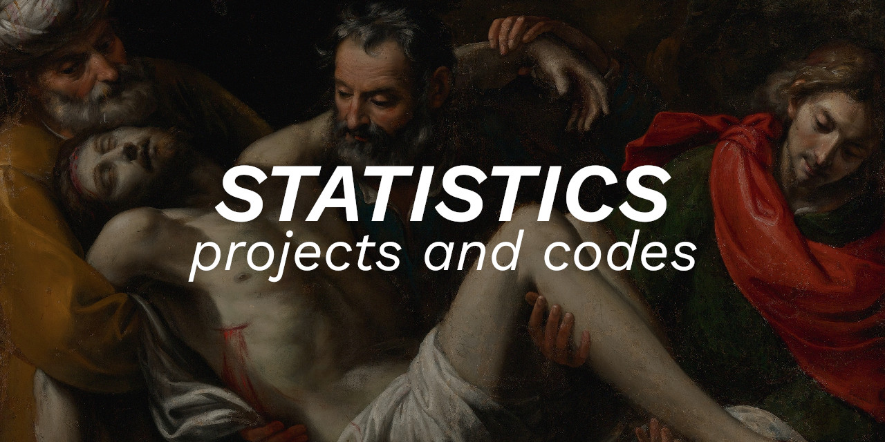

 

Language: <a href='readme-pt.md'>PT-BR</a>

 

In this project my statistics about my public and private projects are stored. It is important to say that only codes written by me are counted, third-party codes do not count.

 

<table width='100%'>
<tr>
    <td>
        <b>Total lines</b>
    </td>
    <td>
        31912
    </td>
    </tr><tr>
<td>
    <b>C, C++, and headers</b>
</td>
<td>
    17470
</td>
</tr><tr>
<td>
    <b>Grammar (Lex, Yacc, and ANTLR4</b>
</td>
<td>
    2293
</td>
</tr><tr>
<td>
    <b>PHP</b>
</td>
<td>
    1709
</td>
</tr><tr>
<td>
    <b>Typescript</b>
</td>
<td>
    1709
</td>
</tr><tr>
<td>
    <b>Javascript</b>
</td>
<td>
    4410
</td>
</tr><tr>
<td>
    <b>Sass and Pure CSS</b>
</td>
<td>
    2446
</td>
</tr><tr>
<td>
    <b>SQL</b>
</td>
<td>
    889
</td>
</tr><tr>
<td>
    <b>Shell script</b>
</td>
<td>
    986
</td>
</tr>
</table>

